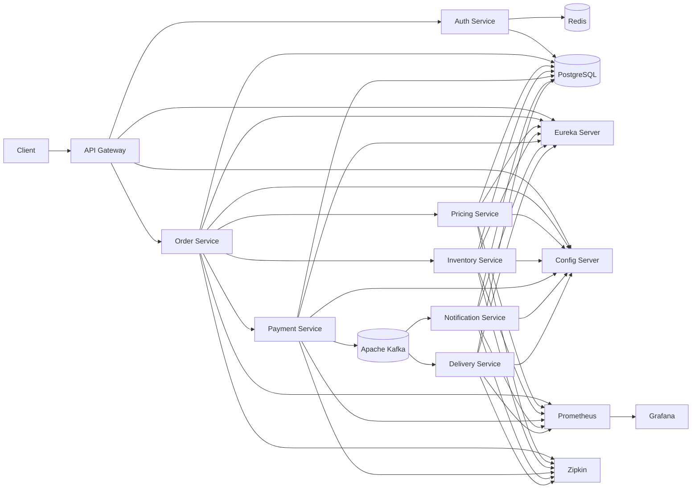
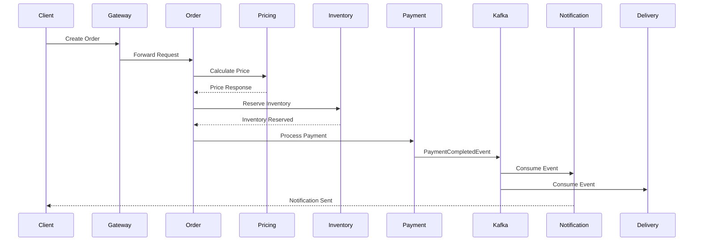

# 🚀 Real-Time Event Streaming Platform
    
> A production-inspired event-driven microservices platform that simulates the backend architecture of modern food delivery and e-commerce systems using **Java**, **Spring Boot**, **Apache Kafka**, **PostgreSQL**, **Redis**, **Docker**, and **Kubernetes**.

This project demonstrates how modern distributed backend systems are designed using asynchronous messaging, distributed transactions, cloud-native deployment, and production-grade engineering practices.

It simulates the backend architecture of large-scale applications such as food delivery, ride-sharing, and e-commerce platforms where multiple independent services collaborate to process business workflows reliably.

---
# 📖 Project Overview

The Real-Time Event Streaming Platform is a distributed event-driven microservices application that processes customer orders through multiple independent services.

Instead of relying on a single monolithic application, each business capability is implemented as an independent microservice communicating through REST APIs and Apache Kafka events.

The platform demonstrates production-inspired backend patterns including:

- Event-Driven Architecture
- Saga Pattern
- Transactional Outbox Pattern
- Idempotent Consumers
- Distributed Configuration
- Service Discovery
- API Gateway
- Resilience Patterns
- Distributed Tracing
- Kubernetes Deployment

The objective of this project is to showcase how modern backend systems achieve scalability, resiliency, maintainability, and fault tolerance using industry-standard technologies.

---
# 🎯 Why This Project?

Modern distributed applications rarely consist of a single backend service.

Large-scale platforms such as Uber, Swiggy, Zomato, Amazon, and Netflix operate hundreds of independent services that communicate through synchronous APIs and asynchronous event streams.

Building reliable distributed systems introduces challenges including:

- Service-to-service communication
- Distributed transactions
- Event consistency
- Fault tolerance
- Service discovery
- Configuration management
- Observability
- Deployment automation

This project was built to explore and implement these production-inspired architectural patterns using the Spring ecosystem and Kubernetes.

---
# ✨ Key Features

## Authentication & Security

- JWT Authentication
- Spring Security
- API Gateway Authentication

## Event-Driven Architecture

- Apache Kafka
- Event Publishing
- Event Consumption
- Saga Pattern
- Transactional Outbox
- Idempotent Consumers

## Reliability

- Resilience4j
- Circuit Breaker
- Retry
- Dead Letter Topics (DLT)
- Retry Topics

## Data Layer

- PostgreSQL
- Redis Cache
- Spring Data JPA

## Observability

- Spring Boot Actuator
- Prometheus
- Grafana
- Zipkin Distributed Tracing

## Cloud Native

- Docker
- Kubernetes
- ConfigMaps
- Secrets
- Health Probes
- Horizontal Pod Autoscaler
- Ingress
- Network Policies

## DevOps

- GitHub Actions
- Multi-Architecture Docker Images
- GHCR
- Automated CI Pipeline

---
# 🏛️ Design Goals

The platform was designed with the following engineering goals:

- Build an event-driven microservices architecture.
- Demonstrate distributed transaction management using the Saga Pattern.
- Ensure reliable event delivery using the Transactional Outbox Pattern.
- Prevent duplicate event processing through idempotent consumers.
- Improve fault tolerance using Resilience4j.
- Support cloud-native deployment using Kubernetes.
- Provide observability through metrics, tracing, and health monitoring.
- Automate build and deployment using GitHub Actions.

---
# 🛠️ Technology Stack

| Category | Technologies                                      |
|-----------|---------------------------------------------------|
| **Language** | Java 21                                           |
| **Framework** | Spring Boot 3.5.16                                |
| **Microservices** | Spring Cloud 2025.0.0                             |
| **Security** | Spring Security, JWT                              |
| **API Gateway** | Spring Cloud Gateway                              |
| **Service Discovery** | Eureka Server                                     |
| **Configuration** | Spring Cloud Config Server                        |
| **Messaging** | Apache Kafka                                      |
| **Database** | PostgreSQL                                        |
| **Caching** | Redis                                             |
| **Persistence** | Spring Data JPA, Hibernate                        |
| **Resilience** | Resilience4j                                      |
| **Observability** | Spring Boot Actuator, Prometheus, Grafana, Zipkin |
| **Containerization** | Docker                                            |
| **Orchestration** | Kubernetes                                        |
| **CI/CD** | GitHub Actions                                    |
| **Build Tool** | Maven                                             |

---

# 🏗️ High-Level Architecture


---
# 🧩 Microservices Overview

| Service | Responsibility |
|----------|----------------|
| **API Gateway** | Entry point for all client requests, JWT validation, and request routing. |
| **Auth Service** | User authentication, JWT generation, and user management. |
| **Order Service** | Creates and manages customer orders. Coordinates the order workflow. |
| **Pricing Service** | Calculates pricing based on products and quantities. |
| **Inventory Service** | Reserves and releases inventory during order processing. |
| **Payment Service** | Simulates payment processing and publishes payment events. |
| **Notification Service** | Consumes Kafka events and sends order notifications. |
| **Delivery Service** | Manages delivery creation and status updates. |
| **Config Server** | Centralized configuration for all services. |
| **Discovery Server** | Eureka-based service registry and discovery. |

---

# 📡 Service Communication

The platform uses both synchronous REST communication and asynchronous event streaming.

| Communication Type | Technology | Purpose |
|--------------------|------------|---------|
| Client → Gateway | HTTP | External API access |
| Gateway → Services | HTTP | Request routing |
| Service → Service | REST | Synchronous operations |
| Service → Service | Apache Kafka | Asynchronous event publishing |
| Service Discovery | Eureka | Dynamic service lookup |
| Configuration | Config Server | Centralized configuration |

---
# 🧠 Architectural Patterns

The platform incorporates several commonly used distributed system patterns:

| Pattern | Purpose |
|----------|---------|
| **Microservices Architecture** | Independent deployment and scaling of business capabilities. |
| **API Gateway** | Single entry point for clients. |
| **Service Discovery** | Dynamic service registration and lookup using Eureka. |
| **Centralized Configuration** | Externalized configuration using Spring Cloud Config. |
| **Event-Driven Architecture** | Loose coupling through Kafka-based messaging. |
| **Saga Pattern** | Coordination of distributed transactions across services. |
| **Transactional Outbox** | Reliable event publication alongside database transactions. |
| **Idempotent Consumers** | Safe handling of duplicate Kafka messages. |
| **Circuit Breaker** | Failure isolation with Resilience4j. |
| **Distributed Tracing** | End-to-end request visibility using Zipkin. |
| **Caching** | Improved read performance using Redis. |

---

# 📂 Repository Structure

```text
Real-Time-Event-Streaming-Platform/
│
├── .github/                    # GitHub Actions workflows
├── .mvn/                       # Maven Wrapper files
│
├── api-gateway/                # Spring Cloud Gateway
├── auth-service/               # Authentication & JWT Service
├── common/                     # Shared DTOs, events, utilities
├── config-server/              # Spring Cloud Config Server
├── delivery-service/           # Delivery Management Service
├── discovery-server/           # Eureka Service Registry
├── infrastructure/             # Shared infrastructure components
├── inventory-service/          # Inventory Management Service
├── notification-service/       # Notification Service
├── order-service/              # Order Management Service
├── payment-service/            # Payment Processing Service
├── pricing-service/            # Pricing Service
├── saga-orchestrator/          # Saga Orchestration Service
├── websocket-service/          # Real-time WebSocket Service
├── websocket-client/           # WebSocket Test Client
│
├── docker/                     # Docker configurations
├── k8s/                        # Kubernetes manifests
├── scripts/                    # Utility & deployment scripts
├── docs/                       # Project documentation
├── postman/                    # Postman collections
│
├── pom.xml                     # Root Maven multi-module project
├── mvnw
├── mvnw.cmd
├── kubeconfig.yaml             # Local Kubernetes config (development)
├── .gitignore
├── .dockerignore
└── README.md
```
---

# 🧩 Service Responsibilities

## API Gateway

Acts as the single entry point for all client requests.

Responsibilities:

- Request routing
- JWT validation
- Authentication
- Load balancing
- Cross-cutting concerns

---

## Auth Service

Responsible for user identity.

Responsibilities:

- User registration
- Login
- JWT generation
- JWT validation
- User management

---

## Order Service

Coordinates the order lifecycle.

Responsibilities:

- Create orders
- Validate requests
- Invoke Pricing Service
- Start Saga workflow
- Publish domain events

---

## Pricing Service

Calculates order pricing.

Responsibilities:

- Product pricing
- Discount calculation
- Final amount computation

---

## Inventory Service

Maintains stock consistency.

Responsibilities:

- Reserve inventory
- Release inventory
- Update stock levels

---

## Payment Service

Processes customer payments.

Responsibilities:

- Payment authorization
- Payment status updates
- Publish payment events

---

## Notification Service

Handles customer notifications.

Responsibilities:

- Consume Kafka events
- Send email/SMS notifications
- Persist notification history

---

## Delivery Service

Creates delivery requests.

Responsibilities:

- Create deliveries
- Track delivery status
- Consume order events

---
# 🔄 Order Processing Flow

The platform processes customer orders using a combination of synchronous REST communication and asynchronous Kafka events.


---

# 📨 Kafka Topics

| Topic | Producer | Consumer |
|---------|----------|-----------|
| pricing-calculated | Pricing Service | Order Service |
| inventory-reserved | Inventory Service | Order Service |
| inventory-released | Inventory Service | Order Service |
| payment-completed | Payment Service | Notification Service, Delivery Service |
| payment-failed | Payment Service | Order Service |
| notification-sent | Notification Service | Monitoring |

---
# 🗄️ Database Ownership

Each microservice owns its database and does not directly access another service's data.

| Service | Database |
|-----------|-----------|
| Auth Service | auth |
| Order Service | orders |
| Pricing Service | pricing |
| Inventory Service | inventory |
| Payment Service | payment |
| Notification Service | notification |
| Delivery Service | delivery |
| Saga Service | saga |

---

# 🌐 Request Lifecycle

1. Client sends a request to the API Gateway.
2. Gateway authenticates the request using JWT.
3. Gateway forwards the request to the appropriate microservice.
4. Services communicate synchronously using REST where immediate responses are required.
5. Business events are published asynchronously to Apache Kafka.
6. Consumer services process events independently.
7. Each service updates only its own database.
8. Metrics, traces, and health information are exported to the observability stack.

---
# 📋 Prerequisites

Before running the project, ensure the following tools are installed:

| Tool | Version |
|------|---------|
| Java | 21 |
| Maven | 3.9+ |
| Docker | Latest |
| Kubernetes | 1.30+ |
| kubectl | Latest |
| Git | Latest |

The platform also requires the following infrastructure services:

- PostgreSQL
- Apache Kafka
- Redis
- Zipkin
- Prometheus
- Grafana
---
# 💻 Running Locally

## Clone the repository

```bash
git clone https://github.com/anujyadav11/Real-Time-Event-Streaming-Platform.git

cd Real-Time-Event-Streaming-Platform
```

## Build the project

```bash
./mvnw clean install
```

## Start infrastructure

```bash
docker compose up -d
```

## Start the services

Run the services in the following order:

1. Discovery Server
2. Config Server
3. API Gateway
4. Auth Service
5. Pricing Service
6. Inventory Service
7. Payment Service
8. Notification Service
9. Delivery Service
10. Saga Orchestrator
11. Order Service
12. WebSocket Service

---
# 🐳 Docker Deployment

Build all Docker images:

```bash
./mvnw clean package

docker build -t service-name .
```

Or pull pre-built images from GitHub Container Registry.

Start the local infrastructure using:

```bash
docker compose up -d
```

Verify running containers:

```bash
docker ps
```
---
# ☸️ Kubernetes Deployment

The project includes Kubernetes manifests for deploying the complete platform.

## Deploy

```bash
kubectl apply -k k8s/overlays/docker-desktop
```

## Verify Pods

```bash
kubectl get pods -n event-platform
```

## Verify Services

```bash
kubectl get svc -n event-platform
```

## Verify Ingress

```bash
kubectl get ingress -n event-platform
```

## Delete Deployment

```bash
kubectl delete -k k8s/overlays/docker-desktop
```

The Kubernetes deployment includes:

- Deployments
- Services
- ConfigMaps
- Secrets
- Ingress
- Horizontal Pod Autoscaler
- Network Policies
- Service Accounts
- Resource Requests & Limits
- Health Probes
- Rolling Updates

---
# 🔄 CI/CD Pipeline

The project uses GitHub Actions to automate build, test, containerization, and deployment workflows.

## Pipeline Overview

```text
Developer
      │
      ▼
Git Push
      │
      ▼
GitHub Actions
      │
      ├── Build
      ├── Run Tests
      ├── Package
      ├── Build Docker Images
      ├── Push Images to GHCR
      └── Deploy to Kubernetes
```

Current pipeline stages:

- Checkout Source
- Setup Java
- Cache Maven Dependencies
- Build Project
- Run Unit Tests
- Package Services
- Build Multi-Architecture Docker Images
- Push Images to GitHub Container Registry
- Deploy to Kubernetes
---
# 🏛️ Engineering Decisions

| Decision | Reason |
|----------|--------|
| Spring Boot | Mature ecosystem for Java microservices. |
| Spring Cloud Gateway | Centralized routing and authentication. |
| Eureka | Dynamic service registration and discovery. |
| Kafka | Asynchronous communication between services. |
| Saga Pattern | Coordinate distributed transactions without two-phase commit. |
| Transactional Outbox | Ensure reliable event publication. |
| PostgreSQL | Reliable relational database for transactional data. |
| Redis | Low-latency caching and idempotency support. |
| Kubernetes | Cloud-native deployment and orchestration. |
| GitHub Actions | Automated CI/CD pipeline. |
| Zipkin | End-to-end distributed request tracing. |
| Prometheus & Grafana | Metrics collection and visualization. |

---
# 📚 What This Project Demonstrates

This project showcases practical experience with:

- Designing and building distributed microservices
- Event-driven architectures with Apache Kafka
- Distributed transactions using the Saga Pattern
- Reliable messaging with the Transactional Outbox Pattern
- JWT-based authentication and API Gateway routing
- Service discovery and centralized configuration
- Redis caching and idempotent event processing
- Observability with Prometheus, Grafana, and Zipkin
- Docker containerization and Kubernetes deployment
- CI/CD automation using GitHub Actions
---
# 📸 Project Screenshots

## API Gateway

> _Gateway routing and request handling_


---

## Eureka Dashboard

> _Service registration and discovery_


---

## Kafka UI

> _Kafka topics, producers, and consumers_


---

## Prometheus

> _Metrics collection_


---

## Grafana

> _Application dashboards_


---

## Zipkin

> _Distributed tracing_


---

## Kubernetes

> _Running pods and services_


---

## GitHub Actions

> _Successful CI/CD pipeline_


---
## Swagger UI

> Interactive API documentation generated using OpenAPI.


---
## API Documentation

Interactive API documentation is available through the API Gateway.

| Environment | URL |
|-------------|-----|
| Local | http://localhost:8080/swagger-ui/index.html |
| Kubernetes | http://event-platform.local/swagger-ui/index.html |

# 🎥 Demo

The following demonstrates the complete order workflow:

1. User Login
2. JWT Generation
3. Create Order
4. Pricing Calculation
5. Inventory Reservation
6. Payment Processing
7. Kafka Event Publication
8. Notification Delivery
9. Delivery Creation

A demonstration video will be available here.

> **Coming Soon**
---
# 🚀 Future Roadmap

The current implementation focuses on the core architecture of an event-driven microservices platform.

Future enhancements include:

- Helm Charts
- ArgoCD (GitOps)
- AWS EKS Deployment
- OpenTelemetry
- Centralized Logging (ELK/Loki)
- API Rate Limiting
- Role-Based Access Control (RBAC)
- Distributed Locking
- Chaos Testing
- Performance Testing (k6)
- Canary Deployments
- Blue-Green Deployments

---
# 🤝 Contributing

Contributions, suggestions, and feedback are welcome.

If you would like to contribute:

1. Fork the repository.
2. Create a feature branch.
3. Commit your changes.
4. Open a Pull Request.

Please ensure all tests pass before submitting changes.

---
# 📄 License

This project is licensed under the MIT License.

See the LICENSE file for details.

---
# 👨‍💻 Author

**Anuj Yadav**

Backend Engineer | Java | Spring Boot | Distributed Systems

GitHub: https://github.com/anujyadav11

LinkedIn: <your-linkedin>

If you found this project useful, consider giving it a ⭐.