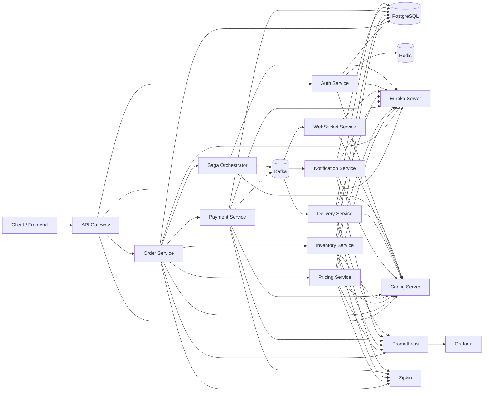
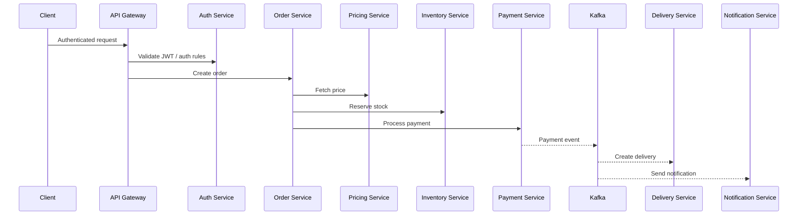

# Real-Time Event Streaming Platform


A production-inspired, event-driven microservices platform that simulates the backend architecture of modern ordering, delivery, and e-commerce systems.

Built with Java 21, Spring Boot, Kafka, PostgreSQL, Redis, Docker, and Kubernetes, this project shows how independent services can collaborate through APIs and events to process business workflows reliably.

## Highlights

- Event-driven order lifecycle
- JWT-secured API gateway
- Kafka-based async communication
- Saga and transactional outbox patterns
- Centralized config and service discovery
- Dockerized local environment
- Kubernetes-ready deployment manifests
- Observability with Prometheus, Grafana, Zipkin, and Actuator
- GitHub Actions based CI/CD

## Table of contents

- [Overview](#overview)
- [Architecture](#architecture)
- [Platform services](#platform-services)
- [Engineering patterns](#engineering-patterns)
- [Tech stack](#tech-stack)
- [Repository structure](#repository-structure)
- [Order workflow](#order-workflow)
- [Screenshots](#screenshots)
- [Getting started](#getting-started)
- [Run with Docker Compose](#run-with-docker-compose)
- [Run with Kubernetes](#run-with-kubernetes)
- [API docs and Postman](#api-docs-and-postman)
- [Observability](#observability)
- [CI/CD](#cicd)
- [Next version roadmap](#next-version-roadmap)
- [Support and connect](#support-and-connect)
- [Contribution](#contribution)
- [License](#license)

## Overview

The Real-Time Event Streaming Platform is a distributed microservices application that processes orders across multiple backend services.

Instead of a monolith, the platform separates business capabilities into focused services that communicate through REST and Apache Kafka. This makes the system easier to scale, maintain, evolve, and observe.

This repository is designed to showcase production-style backend ideas such as:

- event-driven architecture
- eventual consistency
- saga-based workflow coordination
- idempotent event consumption
- fault tolerance and retries
- centralized configuration
- service discovery
- containerized deployment
- cloud-native operations

## Architecture



## Platform services

| Service | Purpose | Default port |
|---|---|---:|
| API Gateway | Single entry point, JWT validation, routing, aggregated Swagger UI | 8080 |
| Auth Service | Authentication, token generation, security, user management | 8087 |
| Order Service | Creates and manages orders, drives the order workflow | 8081 |
| Pricing Service | Calculates or returns pricing data | 8089 |
| Inventory Service | Reserves and releases stock | 8082 |
| Payment Service | Processes payments and emits payment events | 8083 |
| Saga Orchestrator | Coordinates distributed workflow transitions | 8095 |
| Delivery Service | Creates deliveries and tracks delivery state | 8086 |
| Notification Service | Consumes events and emits user notifications | 8084 |
| WebSocket Service | Pushes real-time updates to clients | 8088 |
| Config Server | Centralized configuration server | 8888 |
| Discovery Server | Eureka service registry | 8761 |

## Engineering patterns

This project demonstrates several useful backend and distributed-systems patterns:

- Event-driven architecture
- Saga pattern
- Transactional outbox
- Idempotent consumers
- Dead-letter and retry handling
- API gateway pattern
- Service discovery
- Centralized configuration
- Health/readiness/liveness checks
- Horizontal Pod Autoscaler support
- Kubernetes network policies and service accounts

## Tech stack

| Category | Technologies |
|---|---|
| Language | Java 21 |
| Framework | Spring Boot 3.5.16 |
| Cloud stack | Spring Cloud 2025.0.0 |
| Security | Spring Security, JWT |
| Messaging | Apache Kafka |
| Persistence | PostgreSQL, Spring Data JPA, Hibernate |
| Cache | Redis |
| Mapping | MapStruct |
| Observability | Spring Boot Actuator, Prometheus, Grafana, Zipkin |
| Docs | Springdoc OpenAPI / Swagger UI, Postman collections |
| Build | Maven |
| Containers | Docker |
| Orchestration | Kubernetes, Kustomize |
| Automation | GitHub Actions, CodeQL |

## Repository structure

```text
.
├── api-gateway/
├── auth-service/
├── common/
├── config-server/
├── delivery-service/
├── discovery-server/
├── infrastructure/
├── inventory-service/
├── notification-service/
├── order-service/
├── payment-service/
├── pricing-service/
├── saga-orchestrator/
├── websocket-service/
├── docker/
│   ├── docker-compose.yaml
│   └── <service Dockerfiles>
├── k8s/
│   ├── base/
│   └── overlays/docker-desktop/
├── docs/
│   └── screenshots/
├── postman/
└── .github/workflows/
```

## Order workflow

The platform combines synchronous API calls with asynchronous event propagation.



## Screenshots

The repo now includes a screenshot folder structure under [docs/screenshots](/Users/anujyadav/Desktop/Real-Time-Event-Streaming-Platform/docs/screenshots/README.md).

Replace the placeholder files with real screenshots when ready.

### Swagger UI


### Eureka Dashboard


### Kafka UI


### Grafana Dashboard


### Zipkin Trace


### Kubernetes View


## Getting started

### Prerequisites

- Java 21
- Maven 3.9+
- Docker Desktop or Docker Engine
- `kubectl` for Kubernetes usage
- A Kubernetes cluster if you want to test the manifests

### Build the whole project

```bash
./mvnw clean verify
```

If you only want packaged jars without running tests:

```bash
./mvnw clean package -DskipTests
```

## Run with Docker Compose

The repository includes a full local stack in [docker/docker-compose.yaml](/Users/anujyadav/Desktop/Real-Time-Event-Streaming-Platform/docker/docker-compose.yaml).

### Start the platform

```bash
docker compose -f docker/docker-compose.yaml up --build
```

### Services started by Compose

Infrastructure:

- PostgreSQL
- Redis
- Kafka
- Kafka UI
- Prometheus
- Grafana
- Zipkin

Application services:

- config-server
- discovery-server
- api-gateway
- auth-service
- order-service
- pricing-service
- inventory-service
- payment-service
- saga-orchestrator
- delivery-service
- notification-service
- websocket-service

## Run with Kubernetes

Kubernetes manifests are organized under [k8s](/Users/anujyadav/Desktop/Real-Time-Event-Streaming-Platform/k8s).

### Base resources include

- Namespace
- ConfigMaps
- Secrets
- Infrastructure components
- Application Deployments and Services
- HPAs and PodDisruptionBudgets for selected services
- NetworkPolicies
- ServiceAccounts
- Ingress

### Docker Desktop overlay

The project ships with a local overlay for Docker Desktop Kubernetes:

- [k8s/overlays/docker-desktop/kustomization.yaml](/Users/anujyadav/Desktop/Real-Time-Event-Streaming-Platform/k8s/overlays/docker-desktop/kustomization.yaml)
- [k8s/overlays/docker-desktop/README.md](/Users/anujyadav/Desktop/Real-Time-Event-Streaming-Platform/k8s/overlays/docker-desktop/README.md)

Build the jars and local images first:

```bash
./mvnw clean package -DskipTests

docker build -f docker/api-gateway/Dockerfile -t event-platform/api-gateway:swagger-test .
docker build -f docker/auth-service/Dockerfile -t event-platform/auth-service:swagger-test .
docker build -f docker/order-service/Dockerfile -t event-platform/order-service:swagger-test .
docker build -f docker/inventory-service/Dockerfile -t event-platform/inventory-service:swagger-test .
docker build -f docker/pricing-service/Dockerfile -t event-platform/pricing-service:swagger-test .
docker build -f docker/delivery-service/Dockerfile -t event-platform/delivery-service:swagger-test .
```

Apply the overlay:

```bash
kubectl apply -k k8s/overlays/docker-desktop
kubectl rollout status deployment/app-api-gateway -n event-platform --timeout=10m
kubectl port-forward -n event-platform service/app-api-gateway 8080:8080
```

Then open:

- Swagger UI: <http://localhost:8080/swagger-ui.html>

## API docs and Postman

### Swagger / OpenAPI

The API Gateway exposes aggregated Swagger UI.

After the stack is running, open:

- `http://localhost:8080/swagger-ui.html`

Configured downstream docs include:

- Auth Service
- Order Service
- Inventory Service
- Pricing Service
- Delivery Service

### Postman collection

The repository already includes a Postman workspace under [postman](/Users/anujyadav/Desktop/Real-Time-Event-Streaming-Platform/postman).

Available request groups include:

- Authentication
- Order Service
- Inventory Service
- Pricing Service
- Payment Service
- Delivery Service

## Observability

The platform includes a full observability toolchain.

### Components

- Spring Boot Actuator for health and metrics
- Prometheus for scraping metrics
- Grafana for dashboards
- Zipkin for distributed tracing
- Kafka UI for topic inspection

### Typical local URLs

When running through Docker Compose, these are the usual entry points:

- API Gateway: `http://localhost:8080`
- Eureka Dashboard: `http://localhost:8761`
- Config Server: `http://localhost:8888`
- Swagger UI: `http://localhost:8080/swagger-ui.html`
- Kafka UI: `http://localhost:8085`
- Prometheus: `http://localhost:9090`
- Grafana: `http://localhost:3000`
- Zipkin: `http://localhost:9411`

## CI/CD

GitHub Actions workflows live in [.github/workflows](/Users/anujyadav/Desktop/Real-Time-Event-Streaming-Platform/.github/workflows).

### Current automation

- `ci.yml`
  - builds and tests the Maven multi-module project
  - builds and pushes Docker images for the services on pushes to `main`
  - publishes images to GitHub Container Registry
- `codeql.yml`
  - performs static analysis for Java and Kotlin code
- `dependabot.yml`
  - keeps Maven and GitHub Actions dependencies updated

### Container publishing

The CI workflow publishes these service images through a matrix build:

- api-gateway
- auth-service
- config-server
- discovery-server
- order-service
- inventory-service
- pricing-service
- payment-service
- notification-service
- delivery-service
- websocket-service
- saga-orchestrator

## Next version roadmap

The next version of this project is focused on pushing it from strong engineering demo to production-grade platform.

### Phase 1 — Production hardening

- distributed tracing improvements
- centralized structured JSON logging with correlation IDs
- Micrometer custom business metrics
- Kafka consumer lag metrics
- custom Grafana dashboards
- Prometheus alerting rules and Alertmanager
- gateway rate limiting
- distributed locking with Redis
- feature flags
- audit logging

### Phase 2 — Security

- refresh tokens
- token rotation
- RBAC
- method-level authorization
- API key support for internal services
- secret rotation
- HTTPS/TLS
- mTLS between services

### Phase 3 — Reliability

- inbox pattern
- exactly-once processing improvements
- Kafka transactions
- poison message handling
- dead-letter replay endpoint
- compensation monitoring
- retry dashboard

### Phase 4 — Scalability

- Redis cluster
- Kafka partition tuning
- horizontal scaling tests
- load testing with k6 or JMeter
- autoscaling based on custom metrics

### Phase 5 — Cloud

- AWS EKS
- RDS
- ElastiCache
- MSK
- ALB Ingress Controller
- Route53
- ACM
- ECR

### Phase 6 — GitOps

- Helm charts
- ArgoCD
- progressive delivery
- blue/green deployments
- canary deployments

## Support and connect

If you found this project useful, consider supporting it and connecting with the author.

- Give the project a star: [Star this repository](https://github.com/anujyadav11/Real-Time-Event-Streaming-Platform)
- GitHub: [github.com/anujyadav11/Real-Time-Event-Streaming-Platform](https://github.com/anujyadav11/Real-Time-Event-Streaming-Platform)
- LinkedIn: [Add your LinkedIn profile URL here](https://www.linkedin.com/)

## Contribution

Contributions are welcome.

If you want to improve the project:

1. Fork the repository
2. Create a feature branch
3. Make your changes
4. Run the build and tests locally
5. Open a pull request with a clear description

Recommended before submitting:

```bash
./mvnw clean verify
```

Good contribution areas:

- new business workflows
- improved resiliency and observability
- better dashboards and docs
- more automated tests
- improved Kubernetes manifests

## License

This project is currently presented as MIT-licensed in earlier README styling, but the repository does not yet include a standalone `LICENSE` file.

If you want, the next step should be to add an actual `LICENSE` file so the licensing is explicit and unambiguous.
